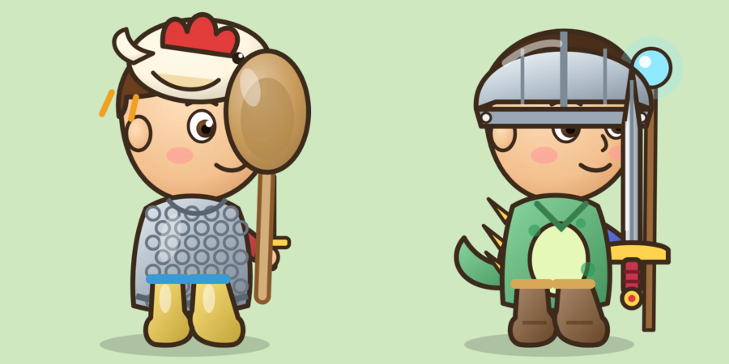
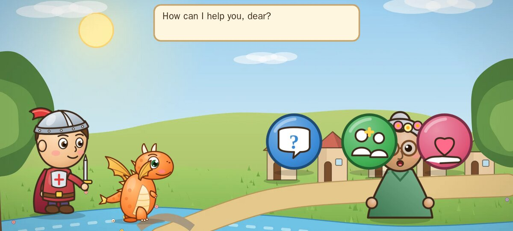
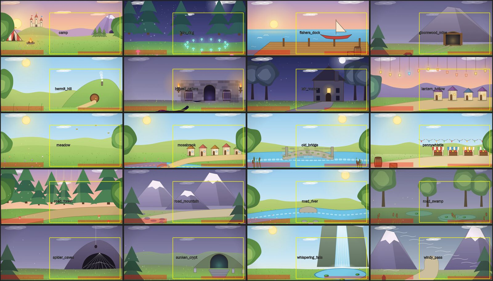
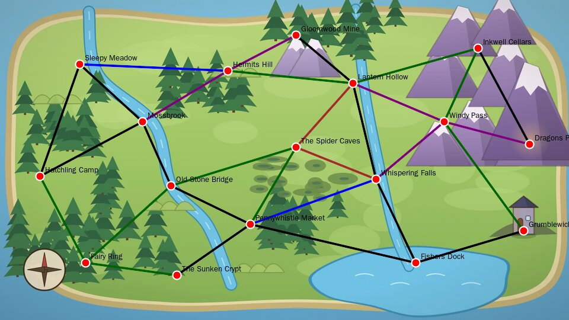

# The Little Dungeon: critical review and roadmap

Date: 2026-10-04. Scope: `main` at `880bbfe` (PR #15, the story engine, merged).

This review is deliberately critical. The project has real strengths: a clean engine/app split, a
seeded and testable engine, a voice pipeline that records every line ahead of time, a regenerable art
pipeline, and a content model that already treats people, places and stories as data. The problems below
are mostly the cost of moving fast through four designs in three days (counting toy, storybook, single
dungeon, open world). Old designs, old docs and old promises were left in place, and nothing measures
whether the game is still the one the brief asked for.

## Contents

1. [How this review was done](#how-this-review-was-done)
2. [The ten findings that matter most](#1-the-ten-findings-that-matter-most)
3. [System architecture issues](#2-system-architecture-issues)
4. [Story and gameplay-loop inconsistencies](#3-story-and-gameplay-loop-inconsistencies)
5. [Documentation and design drift](#4-documentation-and-design-drift)
6. [Learning games: issues](#5-learning-games-issues)
7. [Art review: artifacts, overlap and layering](#6-art-review-artifacts-overlap-and-layering)
8. [Art style and the art generation system](#7-art-style-and-the-art-generation-system)
9. [Voices, voice quality and sound packs](#8-voices-voice-quality-and-sound-packs)
10. [New minigames (9)](#9-new-minigames)
11. [Storyline additions (8)](#10-storyline-additions)
12. [Step-by-step plan](#11-step-by-step-plan)
13. [What this review did not cover: the next five areas](#12-what-this-review-did-not-cover-the-next-five-areas-to-investigate)
14. [Appendix: simulation numbers](#appendix-a-simulation-numbers)

---

## How this review was done

- **Read everything:** README, ARCHITECTURE, decisions #1 to #52, every file in `docs/design/`, the voice
  script, sound credits, CI, the issue template, all engine and app Kotlin (about 20,000 lines) and the art
  pipeline (`art/build.py`, `art/render.cjs`, `art/src/*.py`).
- **Ran the engine tests** outside Android. All 51 pass. 23 of them exercise code the app no longer runs
  (`Adventure`, `GameSession`, `CountObjects*`), and `VoiceCatalogTest` alone takes 164 seconds.
- **Simulated play.** [`BalanceSim.kt.txt`](BalanceSim.kt.txt) plays 300 journeys: 10 simulated children
  × 10 journeys each, at 60%, 75% and 90% puzzle accuracy, carrying hero, skills and world forward the way
  the app does. Dialog choices are random. Travel follows the baby dragon's hint 60% of the time. Time is
  estimated from narration word counts at about 140 words a minute, plus a few seconds per tap. Treat the
  numbers as the shape of the game, not exact measurements. Full output is in [Appendix A](#appendix-a-simulation-numbers).
- **Checked the art the way the phone draws it:** stacked layers in the order `Rigs.kt` uses, mocked a
  dialog screen at a 20:9 phone shape, overlaid the kingdom's data on the map painting, and marked where
  characters and puzzles land on every backdrop. The pictures are in [`img/`](img/).

Severity used below: **P0** breaks the core promise to the child; **P1** visibly wrong or blocks growth;
**P2** quality and maintainability.

---

## 1. The ten findings that matter most

1. **A journey takes about 25 minutes and cannot be saved (P0).** Median 150 to 175 beats, about 25
   puzzles and 55 menus per journey; estimated median 24 to 28 minutes, 90th percentile 40 to 65. Progress is
   saved only at the finale ([`GameViewModel.kt:61`](../../app/src/main/kotlin/com/littledungeon/ui/game/GameViewModel.kt)).
   The Back button, a phone call, or Android reclaiming memory throws the whole journey away, coins, items,
   friendships and the challenge log included. The brief asks for about 10 minutes a run; decision #29
   (a session ends gently after 10 to 15 minutes) is not implemented.
2. **Difficulty only ever goes up (P0).** A failed one-try puzzle is stored as `tries = 2`
   ([`Journey.kt:186`](../../engine/src/main/kotlin/com/littledungeon/engine/rpg/run/Journey.kt)), and `SkillBook`
   only lowers a level after 3 or more tries, so in the journey a skill can never go down. On top of that,
   `Hero.puzzleBoost` raises every puzzle one level per three hero levels. In the simulation a child who gets
   only 60% right is at level 5 in numbers, colors, patterns, letters and skip counting within 10 journeys.
   A child who only guesses reaches counting level 3 in 40 puzzles.
3. **The right answer is usually the middle card (P0).** `ChallengeFactory.numberOptions` returns the
   answer's nearest neighbours in order. At counting levels 4 and 5 the answer is the centre card **100%** of
   the time; at addition level 1, 100%; at addition level 4, 88%. A child who learns "tap the middle one"
   beats the game without counting.
4. **There is one story (P0 for replayability).** `CoreArcs.all` holds only "The Missing Pages", so
   `ArcPicker` returns it every time. The same setup, clues and Baron play every adventure, even after the
   child has befriended him and he promised to read to the children on Fridays.
5. **The world's memory is mostly write-only (P1).** `knows_baron_lonely`, every `friend:*` flag and every
   relationship score are written and never read. Bandit Bess and the Sneaky Fox have no habitat, so they
   ambush the hero as random road monsters, including after the hero has befriended Bess (about 0.85 times per journey
   in the simulation).
6. **Half of the brief's learning is absent from the game the child plays (P1).** Map reading and potions
   (the brief calls potions "one of the major learning mechanics") produce zero puzzles. Tracing, memory,
   sorting and jigsaws are about 1% each or less. Dice addition is gone. Patterns, numerals, letters and adding
   make up almost everything.
7. **Three of the four class powers, and six of the eight level-up rewards, do nothing (P1).** The Knight's
   reroll, the Ranger's peek and the Guardian's friendliness exist only in the legacy `Adventure`. The crown,
   magic boots, rainbow die and three baby-dragon upgrades are announced at level-up and never drawn or used.
8. **Two game engines live in one codebase (P1).** The single-dungeon `Adventure` (with dice, doors, hearts,
   quests and goblins) is still compiled, tested and partly voiced, beside the `Journey` the app actually runs.
9. **Layering bugs are visible on every screen type (P1).** Worn weapons are drawn over the hero's face, the
   class weapon is not removed when another is held, armor hides the arms, dialog choices cover the face of the
   person speaking, monsters stay full size behind puzzle answers, the world map is stretched about 1.5×
   sideways on a 20:9 phone, and the hero and baby dragon stand in the river in several scenes.
10. **The docs describe three different games (P1).** ARCHITECTURE.md still says "Nothing here is built yet"
    and describes Room, JSON content and a difficulty policy that were never built. The README describes the
    single dungeon. The voice script is for the dino-egg counting toy. At least 12 decisions are contradicted
    by the code without being marked superseded.

---

## 2. System architecture issues

### 2.1 Two engines in one app (P1)

The app runs only `Journey`. Still compiled, tested and maintained:

- `rpg/run/Adventure.kt` (632 lines), most of `rpg/run/Lines.kt`, `rpg/world/Quest.kt` (`QuestWriter`,
  `QuestKind`, `Twist`, `Boss`), `rpg/world/Dungeon.kt` (`DungeonGenerator`, `Stop`, forks),
  `session/GameSession.kt`, `activity/count/*`, `model/ActivityInstance.kt`, `model/Scene.kt`.
- In `Beat.kt`: `Beat.Roll`, `Beat.Doors`, `ChoicePicture`, `Scene.bossStars`, `Place.GATE/GOBLIN_DEN/WORKSHOP/MAP`.
- In the app: `DungeonMapView` (255 lines, unused), `RollBeat`, `DoorsBeat`.
- In `WorldMemory` and `Save.kt`: `friends`, `dragonFriend`, `treasures`, `questsDone`, `lastQuest`, still
  written to every save file. `VoiceCatalog` still fills them with goblin and dragon names.
- `Say.all` still records the dice and heart lines (about 100 sentences) into the APK.

**Why it matters:** every reader, human or AI, has to work out which half is real; 23 tests guard dead
code; the `Beat` API advertises moments the game never produces.
**Direction:** port what is worth keeping (dice and doors come back as minigames in §9), then delete the
rest in one PR, with a save migration that drops the legacy fields.

### 2.2 A journey can't be saved, resumed or replayed (P0)

`Journey` keeps its future as a queue of `JStep` closures and its present in about 20 mutable fields spread
across six extension files (`JourneyTravel`, `JourneyTown`, `JourneyBattle`, `JourneyPuzzles`,
`JourneyDungeon`, `Journey`). Closures can't be serialized, so there is no mid-journey save. `equip`,
`unequip` and `eat` are called on the journey directly rather than through `reply`, so even the reply log in
`FeedbackLog` can't rebuild a journey exactly.

**Direction (cheapest that works): event sourcing.** The engine is already deterministic given its seed.

1. Route every action through one entry point: `Journey.apply(cmd)`, where `Command` is `Reply`, `Equip`,
   `Unequip` or `Eat`.
2. After every command, persist `{seed, start hero/skills/world, commands[]}` (a few KB).
3. On launch, rebuild the journey by replaying the commands, and offer "Continue your adventure" on the title
   screen.
4. Add a determinism test: play, replay from the log, and assert the same beats and the same final state.

Later, if replays get slow, add snapshot checkpoints at towns.

### 2.3 Hidden global state (P2)

- [`JourneyDungeon.kt:31`](../../engine/src/main/kotlin/com/littledungeon/engine/rpg/run/JourneyDungeon.kt):
  `private val dealt = HashMap<Pair<Journey, String>, List<RoomKind>>()` is a top-level map keyed by journey.
  Every journey ever created stays reachable. In the app that leaks one finished journey per adventure; in the
  voice catalog it keeps 3,000. Make it a field of `Journey`.
- `Content.packs` is a global `var`, and `Content.items`, `npcs`, `monsters` rebuild a new list with
  `flatMap` on every call. `Content.item(id)` is a linear scan over a fresh list, called in hot paths
  (`Hero.gear`, which `maxHp`, `attackWith` and `defense` read every time). `Content.kingdom` builds a new
  `Kingdom` on every access. Build an immutable registry with id maps once.

### 2.4 Game rules have moved into the UI (P1)

Decision #3 says composables never decide whether an answer is right. Today
[`Challenges.kt`](../../app/src/main/kotlin/com/littledungeon/ui/game/Challenges.kt) calls `Coach.judge`, runs the
hint ladder (`Ladder`), decides when a one-try puzzle has failed (`Turn.fail`, `allowedMisses`), and judges
tracing, sorting and jigsaws entirely in Compose. The engine trusts whatever `Reply.Solved(failed = …)` it is
given. The one-try rule is split between `askOnce` in the engine and `Turn.miss` in the app.

**Direction:** an engine-side `ChallengeSession` that receives raw input (`Tap(i)`, `Stroke(points)`,
`Drop(item, basket)`, `Place(piece, slot)`) and returns verdicts and hints. The UI only draws. This also makes
tracing and sorting unit-testable and moves timing out of the UI.

### 2.5 English sentences are used as a protocol (P1)

Who speaks (`<pet>`), sounds (`[creak]`) and magic effects all ride inside English text. Effects are guessed
by keyword: [`Fx.forSentence`](../../engine/src/main/kotlin/com/littledungeon/engine/rpg/run/Fx.kt) turns any
sentence containing "bunny" into the bunny trick, so buying Bunny Slippers pops a 🐰 on screen; any sentence
with "glow" glows. This will break the Spanish plan (decision #30): translated lines lose their effects, and
words like "conejo" would need their own rules.

**Direction:** explicit markup (`{fx:bunny}`), lines keyed by id with per-language text, and a test that
every line parses.

### 2.6 "Content is data" is only half true (P2)

Stories, people and items are Kotlin objects, so adding a story means a code change, a rebuild and a voice
render. Several fields are untyped strings: `PeaceStep.kind` ("letters", "pattern"), `Effect.Puzzle(kind)`
turned into an enum with `Obstacle.valueOf` at run time, flags with a `run:` prefix convention, item ids.
`JourneyTest` validates references, which is good, but it doesn't check that a flag that is written is ever
read (which would have caught finding 5).

**Direction:** typed ids (value classes) and enums now; a validator rule "every flag written is read
somewhere, and every flag read is written somewhere"; later a small data format (JSON, YAML or a Kotlin DSL)
the family can edit.

### 2.7 The voice catalog is found by chance (P1)

`VoiceCatalog` plays 3,000 random journeys to discover which sentences exist. Coverage is probabilistic: a
rare combination that never came up is not recorded. On the phone it then falls back to on-device Kokoro (the
slow, hot path decision #45 removed) or to the phone's own TTS (a different voice mid-scene). It also makes CI
slow.

**Direction:** each line template declares its parameter domains, and the catalog enumerates them. Add a
coverage test that plays fresh journeys with a different seed and fails if any spoken sentence is missing
from the catalog.

### 2.8 120 MB to say a name the game no longer says (P1)

Kokoro, espeak-ng data and native libraries ship in the APK so that sentences containing the typed dragon
name can be spoken on the phone. But no line in the journey's content uses `{name}` (it appears only in legacy
`Lines.kt` and a few `Say` lines), and Brogan's dialog hard-codes "Sparky"
([`CoreNpcs.kt:183`](../../engine/src/main/kotlin/com/littledungeon/engine/rpg/story/CoreNpcs.kt)). The
caption still shows the name, so grown-ups don't notice it is never spoken.

**Direction:** either use the name properly and synthesize every name sentence once, in the background, when
a grown-up sets it ("Sparky is practising their new name…"), or drop on-device synthesis and ship a much
smaller APK. Also note espeak-ng is GPL-3.0; see §12 area 3.

### 2.9 Art found by reflection, with silent fallbacks (P2)

`Art.byName` reads `R.drawable` by reflection
([`Pictures.kt:52`](../../app/src/main/kotlin/com/littledungeon/ui/art/Pictures.kt)). ARCHITECTURE §8 promised
explicit maps, and reflection will break if resource shrinking is ever turned on. Missing art falls back
silently: an unknown character becomes the goblin, an unknown item a treasure chest, an unknown place the camp.

**Direction:** generate an `ArtIndex.kt` (name → resource id) from `art/build.py`, keep resources explicitly,
and draw a loud magenta placeholder in debug builds.

### 2.10 Persistence (P2)

`Save.kt` is hand-written JSON with `"version": 1` and no migration path. The challenge log is appended only
at the finale, so a quit journey loses its learning data too. Decision #9's promised parent "export to file"
does not exist.

### 2.11 Tests and CI (P2)

- No UI or screenshot tests, so none of the layering bugs in §6 could be caught. Screenshot tests that run on
  the JVM (Roborazzi or Paparazzi) for each beat type at 16:9 and 20:9 would catch them.
- Nothing tests balance (journey length, faint rate, skill mix, answer position).
- Art is not rebuilt or verified in CI; committed WebPs can drift from `art/src`. `render.cjs` falls back to a
  sandbox-only path (`/opt/node-tools/...`).

### 2.12 No grown-up space (P1)

The brief asks for parent settings separated from play. There are no settings, no session limit, no
difficulty knob (the story-engine plan promised an "easier" setting if one-try caused tears), and no progress
view. The feedback button is a visible one-tap button on the adventure screen with no gate, and it can open a
web browser to GitHub ([`FeedbackUi.kt:176`](../../app/src/main/kotlin/com/littledungeon/ui/game/FeedbackUi.kt)),
taking a child out of the app. Decision #26 chose a hidden two-finger hold precisely because "he'd tap a
visible button".

---

## 3. Story and gameplay-loop inconsistencies

| # | What happens | Where | Fix direction |
|---|---|---|---|
| 1 | Every adventure is "The Missing Pages": same setup, same clues, the same Baron | `CoreArcs.all`, `ArcPicker.pick` | More arcs (§10). Until then, vary the setup and clues by what the world remembers |
| 2 | Befriend the Baron, and next time he is stealing pages again. Professor Hoot says "I know who took them" every time | `ending()` sets `friend:baron_grumblewick`; nothing reads it | After an ending the Baron's state changes: a friend at the manor or a rival. The next page thief is someone else |
| 3 | After five pages: "The Storybook is whole… a new book begins", then chapter one with the same Baron | `JourneyDungeon.kt:184` | A Book One finale (all befriended characters at a Storybook Ball), then Book Two in a new region |
| 4 | The bottle note, the inky handprints and every clue repeat each adventure | `moments()` uses per-journey `visited` | Clues once per world, or a variant per visit |
| 5 | Learning that the Baron is lonely (three places set `knows_baron_lonely`) changes nothing; relationship scores are never read | flags and `Relation` effects | Use them: an extra peace option, a softer meeting, a gift from someone who likes you |
| 6 | Bess and the Fox ambush the hero on any road, even after Bess became a friend. The Fox's taunt "You want it back?" plays with no recipe quest | `CoreMonsters` (no habitat), `roadMonster` ignores friendships | Named characters are never random monsters; `roadMonster` skips `friend:*` |
| 7 | Bess can force a fight: with fewer than 5 coins and kindness under 2 the only option is "Fight her" (18 to 22 times per 100 journeys). Her line says "or play for it" but there is no game option | Bess `hub` node | Every conversation always has a peaceful way out |
| 8 | Tolls aren't tolls: Grumble and Bess demand payment, but "goodbye" walks straight past; the road is never gated | Grumble and Bess hubs | Either gate the road (pay, befriend, puzzle, or go around) or drop the toll language |
| 9 | "Here comes a wolf pup! Fight, or find another way?" and then the fight starts with no choice | `JourneyLines.fightAsk`, `go()` | Offer the other way (sneak past as a memory game, or turn back) |
| 10 | Kind options need Kindness 2 (40 kindness stars), but no skill earns kindness. Only choosing peace at the lair (+10) and Sir Ribbit's joke (+5) do. The kind paths stay locked for several adventures, which pushes the child toward fights | `Hero.statLevel`, `Skill` attributes | Kind choices earn kindness; lower the gates; the Guardian always sees kind options |
| 11 | Class powers: the Knight's reroll (there are no dice), the Ranger's peek (there are no doors) and the Guardian's friendliness don't exist in the journey. The title screen still promises them. The Spellkeeper has the same power as the Wizard | `Adventure.kt` only; `Say.heroLine` | Journey powers per class (plan step 3.5) |
| 12 | "You earned a golden crown!" and nothing appears. Same for magic boots, the rainbow die, and the dragon's sparkles, wings and armor | `Progression.unlocks`; `Rigs.hero` draws only the feather hat and star cape | Draw or use every reward, or don't announce it |
| 13 | The baby dragon's name is never spoken; "Sparky" is hard-coded even after the name changes | `CoreNpcs.kt:183`, `JourneyLines` | `{name}` in companion and narrator lines |
| 14 | Puzzles ignore their story: Henrietta asks to count her chicks, the puzzle counts staircase stones, and she always says "All ten chicks are here!" whatever the count. Hazel's, Merlo's and the Fox's riddles are "The stone face wants a letter". Brogan's test is "The lock wants a number". Otto's stepping stones become lily pads | `Effect.Puzzle(kind)` reuses road obstacles | Puzzles carry their own wording and things to count (plan step 2.6) |
| 15 | A one-try miss says "Try again!" (the old room lines), then "Oh no, that is not the one", then throws the child out | `Lines.*Oops`, `Turn.fail` | Separate lines for one-try misses |
| 16 | Dragon's Peak is painted, named and drawn with its roads on the map, but can never be reached. The Bat King is described by Lumi but never met. Ruby, the goblin, the big dragon and the shadow have art and voices and no role. The camp backdrop shows a castle that isn't in the kingdom | `roadsHere` filter, `CoreMonsters.bat_king` | Fog over places for later stories; give the cast roles (§10) |
| 17 | Time of day jumps with every step (sunset camp, noon meadow, night fairy ring); scenes never show story state (Lantern Hollow's lanterns are "gray with ink" but painted bright) | backdrops | A journey clock, and state variants of key scenes |
| 18 | Peace and fight aren't comparable: peace puzzles are forgiving (hint ladder, no damage), fights are one-try with health. Merlo's Ink Cleaner quest is pointless on the peace path | `peace()` vs `battle()` | Make both paths cost something; the Ink Cleaner helps in peace too ("wash the ink from his hands") |
| 19 | Coins and items pile up forever while prices stay the same; fainting costs a quarter of a growing pile ("you lose sixty coins") | `Hero`, `faint()` | Coin sinks (town projects, cosmetics), and a cap on what fainting costs |
| 20 | The brief's loop is EXPLORE → DISCOVER → CHOOSE → LEARN → RESOLVE → REWARD → STORY. The journey's loop is mostly travel → quiz gate → menu. Learning changes the world only in dungeon rooms; on roads and in fights it is a toll, about 25 pick-one quizzes per journey | `JourneyTravel`, `JourneyBattle` | Fewer, richer moments per journey (plan steps 1.4, 2.3, §9) |
| 21 | Professor Hoot's first meeting line is "Welcome back, little adventurer!" | `CoreNpcs.hoot.intro` | Greeting by state |
| 22 | Captions label characters by voice type, not name: Rascal and Bess are "Sneak:", Professor Hoot is "Elder:" | `Caption` in `Stage.kt` | Pass the speaker's name with the speech |

---

## 4. Documentation and design drift

| Document | What it says | What is true | Action |
|---|---|---|---|
| `README.md` | "First dungeon… pick doors, solve rune doors… potions, befriend the goblin, meet the dragon" | A journey across Whisperwood with the Baron; no doors, potions, goblin or dragon | Rewrite the status paragraph |
| `ARCHITECTURE.md` | "Status: Proposed… Nothing here is built yet." Room, JSON content pack, `ContentValidator`, `AppContainer`, `LearnerModel`, `DifficultyPolicy`, Navigation Compose, parent mode, two-finger feedback, `PLAYTEST_LOG.md`, `art-bible/`, `content-tools/`, "no TTS/AI SDK" | None of these exist; sherpa-onnx and Kokoro ship in the APK. The last update section describes the single dungeon; nothing describes the journey | Move the original proposal to `docs/archive/`; write a short "architecture as built" |
| `PROJECT_DECISIONS.md` | Contradicted but not marked superseded: #6 JSON content, #10 and #11 difficulty policy and `LearnerModel`, #12 and #13 Room, #14 Navigation Compose, #17 no numeric score (now health, damage, coins, levels), #19 every question ends in success (now one try, #51), #22 only taught symbols on screen (now captions, names, "HP 17/25", "Pages 3"), #26 hidden feedback gesture (now a button, #49), #29 sessions of five rounds (not built), #31 app id `dinovalley` (now #52), #39 "nothing is ever lost" (fainting loses coins), #40 class powers, #44 dice and hearts, #48 doors choose the game | | Mark each "Superseded by #N" or "Not built"; add new entries for one-try and for anything kept |
| `PROJECT_DECISIONS.md` #43 | "Both are Apache-2.0" | The APK also ships espeak-ng data, which is GPL-3.0 | Verify before choosing the licence (§12) |
| `docs/design/little-dungeon-plan.md` | The single-dungeon plan | Replaced by the journey | Add a "Superseded by story-engine-plan" banner |
| `docs/design/story-engine-plan.md` | "Approved; building"; slice 6 promises six arcs; slice 8 voice and docs; an "easier" setting under risks | One arc; slice 8 not done; no easier setting | Mark the delivered slices; move the rest to this roadmap |
| `docs/design/adding-content.md` | A place needs "a spot on `scene_world_map`" | The painting has no spots; places are markers drawn by code | Correct it; add the flag rule and an arc checklist |
| `voice/VOICE_SCRIPT.md` | Thirty lines for Mama Dino's eggs; "until your recordings arrive, the game uses the phone's robot voice" | Entirely stale | Replace with a voice bible (§8) |
| `.github/ISSUE_TEMPLATE/playtest.md` | `report.json`, template id, `voice-note.m4a` | The feedback tool sends a text note with seed, beat and replies | Match the template to the real note |
| Code comments | `Beat`: "Beats never end in failure"; `Lines`: "{name} … in the child's own voice"; `Hero.diceBonus` "added to dice rolls"; `HeroClass` "one special power per adventure" | All false in the journey | Fix with the legacy cleanup |
| Content | Mossy Golem is tier `ELITE` but guards Gloomwood Mine as its mini-boss | | Make it a `MINI_BOSS` |

---

## 5. Learning games: issues

1. **Answer position gives the answer away (P0).** See finding 3 and [Appendix A](#appendix-a-simulation-numbers).
   Skip counting has a milder version of the same bias (near-miss options sorted around the answer).
   *Fix:* shuffle positions, balanced so each position wins about equally; keep number-line order only with a
   random window so the answer can be first or last. Test: each position wins 1/n ± 5%.
2. **Adaptation is broken (P0).** See finding 2. Two further problems: promotion after just two first-try
   wins in a row is very fast (ARCHITECTURE §7 designed a windowed rule: at least 5 items, ≥ 85% of the last
   8, the last 3 right); and puzzle level is tied to hero level (`puzzleBoost`), so playing more makes
   puzzles harder whether or not the child is ready.
   *Fix:* record one-try failures as failures (`ChallengeRecord.failed`), use the windowed rule, apply hero level
   to monsters only, and start each session one level easier (warm-up).
3. **Skill coverage is badly skewed (P1).** In 300 simulated journeys: patterns about 20% of puzzles, numerals
   and letters about 15% each, addition 13%, colors 12%, skip counting and counting about 10% each; tracing,
   memory, sorting and jigsaw about 1% each; map reading and recipes 0%. The road obstacle skill is fixed by
   terrain (mountain = counting, river = skip counting, swamp = patterns), not by what the child needs.
   *Fix:* the terrain chooses the costume, the learner chooses the skill; set a per-journey quota.
4. **Phonics errors (P1).** `Words.LETTER_SOUNDS` gives B, D, P, T as "buh", "duh", "puh", "tuh" (the added
   vowel is a classic phonics mistake; ARCHITECTURE itself says "/b/, not buh") and A as "ah" while its picture
   word is "apple" (/æ/). From letter level 3 the game switches entirely to sounds, so letter names stop being
   practised. Level 1 uses 9 letters, and level 2 jumps to all 26. There are no lowercase letters anywhere, even
   though they are most of what a child sees in books. The child's own name letters (decision #24) aren't used.
   *Fix:* clipped stop sounds made the way `letter_sounds.py` makes the held ones (or recorded by a person); the
   short-a vowel; a lowercase track; letter order by visual distinctiveness, starting from the name; keep
   b/d/p/q apart until high levels.
5. **Skip-count wording is wrong (P1).** "Each lily pad has two gems… How many on the last lily pad?" The
   literal answer is two; the expected answer is the running total. *Fix:* "What number goes on the last lily
   pad?" or "How many gems altogether?"
6. **One try with no teaching (P1).** After a miss the child hears "Look, this is the right answer" and is
   turned back. The scaffold that taught (counting the dots together with the dots lighting up, from the dice
   game) is gone, and the Wizard's hint power and the hint ladder only work in the forgiving peace puzzles.
   The brief asks for a miss to bring "a new clue, a different route… a chance to try again".
   *Fix:* keep the consequence, but first a short "let's see why" (count together, sound it out, trace the
   pattern), then an optional practice retry that doesn't count.
7. **Puzzles disconnected from their story (P1).** See §3 row 14. This is the brief's central rule ("story
   first") broken by a shortcut in the data model.
8. **Drag and drawing games are too strict for one try (P2).** Sorting eight items or tracing a four-stroke
   letter allows two slips in total before failing the whole room. *Fix:* count slips per item or stroke, allow
   retries per item, and judge the whole task by accuracy.
9. **Odd difficulty steps (P2).** Numerals: level 3 has 5 options, level 4 only 4. Counting level 5 asks for
   up to 12 objects. Skip counting level 4 counts by tens to 40. Writing level 1 starts with E and F (four
   strokes) and skips the brief's pre-writing ladder (line, curve, zigzag, loop) that `ChallengeFactory.trace`
   already implements.
10. **Color carries too much (P2).** Doors, memory, early patterns, gems and sorting all depend on hue alone.
    About one boy in twelve has a color vision deficiency. *Fix:* pair each hue with a shape or mark.
11. **Quiz fatigue (P1).** About 25 near-identical pick-one quizzes per journey, many of them as road tolls and
    battle attacks. This is the "stop playing and do a math problem" feeling the brief warns about.
12. **Learning data is fragile (P2).** Records are written only at the finale; response time is measured in the
    UI; there is no view of progress for grown-ups.

---

## 6. Art review: artifacts, overlap and layering

### 6.1 Worn gear is stacked in the wrong order (P1)

What `Rigs.hero` produces (layers stacked exactly as the app stacks them):

- **A held item is drawn over the head and face.** The spoon covers the knight's eye; the sword blade crosses
  the wizard's cheek. Worn gear is appended after every body layer, including the face.
- **The class weapon is never removed.** The knight still holds the class sword under the spoon (yellow guard at the
  hand); the wizard holds the class staff and the knight's sword together. The class hat is hidden when head gear is
  worn, but `add(Piece(k.gear, Part.ARM))` ([`Rigs.kt:102`](../../app/src/main/kotlin/com/littledungeon/ui/art/Rigs.kt))
  is unconditional.
- **Body armor covers the arms and hands,** so weapons float in the air.
- **Boots are drawn last,** over everything, including a hand that hangs low.
- **Body and feet gear don't breathe.** They are `Part.STILL` while the body scales 2% with each breath, so the
  body shimmers at the armor's edges.
- **The order of worn items follows map insertion order,** not the slot, so it can change between saves.

**Fix:** a fixed z-order per slot: shadow, cape, legs, **feet gear**, back arm, body, **body gear (breathes
with the body)**, head, face, **head gear**, front arm, **held item**, then a new front-fingers layer so the
hand wraps the grip (split `arm_front` in `heroes.py`). Hide `k.gear` when the hand slot is used. Add a CI
contact sheet: every class × every gear item.

### 6.2 Dialog choices cover the speaker (P1)

Choice cards are centred at x 0.57 to 0.87 of the width and y 0.62 of the height, sized up to 0.3 of the
height. The person speaking stands at x 0.78, y 0.70, 0.55 high
([`JourneyUi.kt:273`](../../app/src/main/kotlin/com/littledungeon/ui/game/JourneyUi.kt),
[`AdventureScreen.kt:352`](../../app/src/main/kotlin/com/littledungeon/ui/game/AdventureScreen.kt)). The
cards land on her face, so her talking mouth is hidden for every dialog choice. In shops the panel (x 0.42 to
0.98) hides the shopkeeper completely.

**Fix:** a choice tray along the bottom between the hero and the speaker, or the speaker steps back and
shrinks the way the wizard already does in the crystal cave.

### 6.3 Battles: the monster stays behind the puzzle and the top of the screen is crowded (P1)

`Cast` draws `BattleStage` on every beat of a fight, puzzles included
([`AdventureScreen.kt:254`](../../app/src/main/kotlin/com/littledungeon/ui/game/AdventureScreen.kt)), while
answers fill x 0.4 to 0.98. The monster, half the screen tall at x 0.76, sits behind the answer tiles. The
"Attack / use an item" cards also land on it. At the top, the caption (up to 4 lines), the monster's name and
health plate (y 0.1 to 0.3) and the bag and hero health bars (top right) compete for the same strip.

**Fix:** during a battle puzzle the monster shrinks to a portrait in the top right with its health bar; give
the HUD fixed rows.

### 6.4 Characters don't share a ground line (P2)

Characters are placed by their centre, and each picture has different padding. Approximate feet positions:
hero 0.93 of the screen height, baby dragon 0.96, townsperson 0.95, small monster 0.91, boss 1.0 (its shadow
is cut off at the bottom edge). Characters float at different depths. **Fix:** anchor every character by its
feet on a per-scene floor line and scale by depth.

### 6.5 Backdrops fight the stage (P1)

- **The landmark that identifies the place sits exactly where puzzles and people appear:** the dungeon doors
  (Inkwell Cellars, Sunken Crypt, Gloomwood Mine), the manor, the cave mouth, the waterfall, the market stalls,
  the boat. Whenever anything happens, the place's identity is covered.
- **Feet land in water:** the hero and dragon stand in the river at Mossbrook, Old Stone Bridge and the river
  road, and at the water's edge at Fishers' Dock.
- **The backdrops are 16:9 and phones are about 20:9,** so `ContentScale.Crop` cuts about 10% off the top and
  bottom. Nothing marks a safe area.
- **Many scenes reuse one template** (frame trees left and right, rolling hills, sun and clouds); the meadow is
  nearly empty.

**Fix:** a stage contract for every scene: a walkable floor band (no water under the left 40%), the landmark in
the upper middle (x 0.25 to 0.6, y 0.15 to 0.55 of the frame), a 20:9 safe area, and metadata per scene (floor
y, landmark box) that the app uses to place characters. Render the contact sheet above in CI.

### 6.6 The world map (P1)

- The painting has no roads and no place pictures (only the manor). The app draws straight lines across it,
  so the data and the painting disagree: easy "road" roads cross rivers with no bridge (Gloomwood Mine to
  Lantern Hollow, Pennywhistle to Fishers' Dock); "forest" roads run through open grass and mountains (Lantern
  Hollow to Inkwell Cellars, Windy Pass to the manor); the "swamp" road from the Spider Caves to Lantern Hollow
  crosses grassland.
- It is drawn with `ContentScale.FillBounds` into a box 0.94 of the width × 0.76 of the height
  ([`JourneyUi.kt:109`](../../app/src/main/kotlin/com/littledungeon/ui/game/JourneyUi.kt)), so on a 20:9
  phone it is stretched about 1.55× sideways (1.24× on 16:9).
- Dragon's Peak shows with its roads but can't be reached.

**Fix:** paint roads and place icons into the map from the same data (`world.py` reads coordinates exported
by an engine task), keep the aspect ratio (fit, with a parchment border filling the rest), draw road styles
that match the terrain, and put fog over places that belong to later stories.

### 6.7 Mixed fidelity between characters (P2)

Heroes and dragons are full rigs (arms, head, three mouths, wings and tails). Every townsperson and monster is
one body layer in the same 240×260 frame: no arms, no happy mouth (happy is the calm mouth), no reaction
poses. All townspeople come from one `person()` template, and every monster is the same height, from slime to
troll. When an NPC talks next to the hero, the difference shows. Monsters have no hit, hurt or befriended
poses.

### 6.8 Emoji still in the interface (P2)

Door signs (⭐🌙 🎨 ✏️ 👀 🧺 🐸 🧩), the bunny trick (🐰), the broken heart (💔), the loading book (📖) and the
feedback button (💬). This contradicts the review decision "no emoji placeholders", and emoji look different on
every phone.

### 6.9 Unused and legacy art (P2)

Ruby (15 layers), the goblin (8), the big dragon (14), the shadow (6), the Bat King (6), the choice pictures,
the cauldron, the doors, and the gate, goblin den, workshop, map and Dragon's Peak scenes are unused by the
journey. They are good material for §9 and §10; keep them, but list in an art manifest which assets are live.

### 6.10 Pipeline gaps (P2)

The WebPs are committed and never rebuilt or checked in CI; there is no manifest (source, licence, owner, live
or not); `render.cjs` has a sandbox-only fallback path.

---

## 7. Art style and the art generation system

**Keep the code-drawn SVG pipeline as the backbone.** It is consistent, layered, regenerable, tiny and
F-Droid-friendly, and it is something Claude can extend. Raise its ceiling:

1. **A style bible (`art/STYLE.md`):** palette per region and time of day; 4 px outline at 1×; one light
   direction (top left) and one shading recipe; size classes relative to the hero (small 0.6, medium 1.0,
   large 1.4, boss 1.8); a face kit (eye shapes, mouth set); silhouette rules (readable at 64 px).
2. **One skeleton, exported as data.** Heroes, gear and rigs agree on anchors (head centre, hand, shoulder,
   neck pivot). Today they are duplicated as magic numbers in `gear.py` and `Rigs.kt`. `heroes.py` should write
   an anchors JSON that both read.
3. **Richer rigs for the cast:** NPCs get an arm that waves and points, a happy mouth, and three mouth shapes
   (closed, open, wide) driven by voice loudness; monsters get hit, dizzy and befriended poses.
4. **Scenes as layers, not one flat picture:** sky, far, middle, landmark, floor and a foreground frame,
   exported separately, so the app can add gentle parallax and dim the landmark while a puzzle is up.
5. **Kits per region** (Mossbrook timber and thatch, Pennywhistle stalls and awnings, Lantern Hollow lamps,
   Gloomwood rock) instead of one generic template, with weather and time-of-day overlays.
6. **State variants:** inky lanterns and clean ones; a dark manor and the manor with the Baron's garden. The
   world should look different after the child changes it.
7. **AI image generation: concept work only.** Use it for mood boards, poses and region looks, then draw the
   result as layered SVG. Decision #35 rejected generated art for shipped assets because of licensing and
   consistency, and that still holds. If generated raster art is ever shipped (backdrops only, never rigged
   characters), use a model whose licence allows redistribution, keep prompts, seeds and model versions in the
   asset manifest, condition it on your own style sheet, and do the originality review the brief asks for.
8. **Accessibility:** hue plus shape or pattern on every color the game asks about; caption contrast checked;
   map markers at least 9 mm across on the family's phones.

---

## 8. Voices, voice quality and sound packs

### 8.1 What's wrong now

- **Too few distinct voices.** Kokoro v0.19 has 11 speakers and 20 roles share them, varied only by speed and
  pitch:

  | Speaker | Shared by |
  |---|---|
  | 9 | Professor Hoot, Hermit Hazel, Old Merlo, the Baron, every skeleton and ghost |
  | 6 | Captain Hob, the Ink Shadow, Sir Ribbit, Otto, and every critter (slime, bat, spiders, Spider Queen, Bat King…) |
  | 0 | Baker Bun, Merchant Zig, Rascal the Fox, Bandit Bess, the Inky Imp |
  | 2 | Mayor Tilly, Healer Willow (neighbours in Mossbrook), Henrietta Hen |
  | 10 | The big dragon, Grumble, every troll, golem and wolf |
  | 5 | The goblin, Brogan, Finn |

- **Pitch is changed by resampling** (`Pcm.pitched` and `render-voice.py`), which also changes speed and shifts the
  formants, giving a chipmunk or slow-motion quality; the straight-line resampling has no anti-alias filter, so
  raised voices (critters at 1.12) pick up a slight metallic edge.
- **The companion is never named aloud** (§2.8), and caption labels show voice types ("Sneak:") instead of
  names.
- **Letter sounds** are wrong for B, D, P, T and A (§5.4).
- **Every line is read with the same energy;** there is no whisper, shout, sleepy or excited delivery.

### 8.2 A cast for Whisperwood (proposed voice bible)

Recording happens in CI, so a bigger model costs build time, not APK size (unless on-device synthesis stays).
Move to **Kokoro v1.0** (the multi-voice release, which sherpa-onnx supports) for about 50 voices across
American and British, female and male, and use **voice blending** (mixing two style vectors) to give every
named character a unique voice. Species voices stay only for unnamed monsters.

| Character | Feel | Suggested direction |
|---|---|---|
| Narrator | Warm storyteller, unhurried, smiling | A warm female voice (as today), speed 0.9, the anchor that never changes |
| Baby dragon | Small, eager, brave-ish | A bright young voice, slightly faster, a "hee!" giggle sound on happy beats |
| Professor Hoot | Old, kind, a little fussy | Older British male voice, slow; a soft "hoo-hoo" sound before lines |
| Baron Grumblewick | Dry, theatrical, sad underneath | Deep British male voice, slow; softer after he is befriended (a second voice setting) |
| Mayor Tilly | Brisk, motherly | Mature American female |
| Healer Willow | Gentle grandmother | Older British female, slow |
| Baker Bun | Flustered, cheerful | Higher female, fast |
| Brogan | Gruff, kind | Low male |
| Merchant Zig | Showman | Fast male, big intonation |
| Rascal the Fox | Sly, quick | Light male with a blend toward a younger voice |
| Bandit Bess | Tough, tired | Low female |
| Lumi | Child, nervous | Young female, a little breathy |
| Sir Ribbit | Pompous, tiny | Blend leaning British, plus a short "ribbit" before lines |
| Grumble | Shy giant | Deepest male, slow; a sniff sound effect |
| Generic critters / spooks / growlers | Species types | Three to four blended voices each, chosen by monster id, so two slimes match and a slime never sounds like Sir Ribbit |

**Improvements:**

- **A hybrid voice:** the family records the twenty or so lines heard most often (the narrator's welcome, the
  dragon's catchphrases, "Level up!"), and Kokoro speaks the long tail. Decision #43 listed this as a good
  later layer.
- **Delivery tags per line** (`{excited}`, `{whisper}`, `{sleepy}`) mapped to speed and blend tweaks.
- **Signature non-speech sounds** per character (hoot, ribbit, sniff, giggle), cheaper and more memorable than
  more words.
- **Three mouth shapes** driven by loudness (closed, open, wide) instead of two.
- **Loudness targets:** voice about −16 LUFS, effects about −20, music about −26, with music ducked 8 to 10 dB
  under speech.

### 8.3 Sound packs and a music system

The game has 29 effects and no music or ambience at all. Licence matters, because the repo is public and F-Droid
is the goal: prefer CC0.

- **Music, CC0:** the Ninja Adventure pack already used for effects also contains a set of CC0 music tracks
  (town, forest, dungeon, battle, victory). Kenney's Music Jingles (already used) covers stingers. Juhani
  Junkala's chiptune sets on OpenGameArt are CC0. Kevin MacLeod (incompetech) is CC-BY: usable, with
  attribution.
- **Ambience, CC0:** Freesound filtered to CC0 (birdsong, stream, wind on the pass, cave drips, market murmur,
  night crickets, lake lapping, fire crackle for the camp). Kenney's packs for UI and foley.
- **Avoid for this repo:** Pixabay (its own licence, not CC0) and the Sonniss GDC bundles (their licence forbids
  redistributing the raw files, which a public repo does).
- **System:** a `Music` player beside `Sfx` with looped region themes and crossfades (camp, town, road by
  terrain, dungeon, battle, boss, peace ending), an ambience bed per scene, ducking under the narrator, and a
  volume control in the grown-up settings. No new dependency is needed (`MediaPlayer` looping, or mixing in
  `Speaker`).
- **Missing effects worth adding:** one per battle item (sleepy dust "shhh", spark bomb pop, bubble shield
  bloop, cookie munch), footsteps per terrain while travelling, a map pin pop, a shop bell, a coin count-up
  tick, and a gentle page-turn for chapter titles.

---

## 9. New minigames

Each is a new `Challenge` type, a generator, an engine judge (§2.4), a composable, a place in the world,
tests and voice lines. In priority order:

1. **Lucky Roll (dice, brought back).** *Skill:* addition and subitizing (seeing a die's dots at a glance).
   *Story:* road events and some attacks: roll two dice, add them up; a 1 or 2 makes something silly happen
   (the brief's rule). The Knight's reroll and the rainbow-die reward finally mean something. Reuses `RollBeat`
   and its count-together scaffold.
2. **The Potion Workshop.** *Skill:* colors, counting, order, working memory, reading a recipe card.
   *Story:* at Willow's or Merlo's, brew potions that change the world: a Glow potion lights a swamp road
   without a lantern, Giant Strength moves a boulder blocking a road, a Bubble potion floats you across a
   river, a Friendship potion opens a peace option. Reuses `PotionRoom` and `RecipeChallenge` (levels 1 to 5
   already exist).
3. **Hoot's Treasure Map.** *Skill:* map reading, the brief's seven-step ladder (find the matching place,
   follow one direction, several directions, use a map, north/south/east/west, remember a route, plan around an
   obstacle). *Story:* Professor Hoot hands over a map with a dotted route on the real Whisperwood map; the
   child follows it to a buried chest. Uses the kingdom graph that already exists.
4. **Lumi's Lanterns.** *Skill:* pre-writing, the ladder the journey skips: line, curve, zigzag, loop, shape,
   then lowercase and uppercase letters. *Story:* trace the glowing wire from lamp to lamp to light Lantern
   Hollow. Reuses `ChallengeFactory.trace` and `TraceRoom`.
5. **Pennywhistle Market Stall.** *Skill:* counting money, addition and subtraction within 10 ("You have 7
   coins, the pie costs 3, how many are left?" is straight from the brief). *Story:* help Zig run his stall:
   pay with exact coins, give change. Coins of 1, 2 and 5.
6. **Grumble's Rhyme Bridge.** *Skill:* phonological awareness, the pre-reading skill the game is missing:
   rhymes, first sounds, clapping syllables. *Story:* each bridge plank is a picture; step only on the ones
   that rhyme with "cat"; clap the syllables of a name to pay the toll.
7. **Sir Ribbit's Bell Song.** *Skill:* auditory memory and patterns (AB, AAB, ABC), the ear's version of the
   rune door. *Story:* listen to the frog knight's bell tune and play it back on three colored bells (each with
   its own shape for color-blind players).
8. **Fair Shares for the Bats.** *Skill:* one-to-one correspondence, more and fewer, early sharing (division).
   This is the `COMPARE_GROUPS` activity ARCHITECTURE planned and never built. *Story:* the Bat King's little
   bats squabble over berries; share them out so every bat gets the same.
9. **Tell It Back.** *Skill:* story sequencing and comprehension: first, next, last. *Story:* at camp after each
   journey, put three picture cards from *this* adventure in order (the engine knows what happened). It
   doubles as a recap for the child and reinforces memory of their own choices.

---

## 10. Storyline additions

Book One should be five *different* stories, each recovering one page, with a finale. Each arc below names its
new people and places, choices and endings, which minigames it uses, and what the world remembers.

1. **The Night of a Thousand Lanterns** (no boss; seasonal). The Bat King has been stealing Lantern Hollow's
   lanterns, because his bats are afraid of the dark too. Lumi (also afraid of the dark) and the child must
   light the town before the festival. *Endings:* the bats get their own glow-lanterns and join the festival,
   or the town agrees to a lantern-sharing night. *Uses:* Lumi's Lanterns, Fair Shares. *Remembers:* lanterns
   stay lit on the map at night; the Bat King waves from the rafters.
2. **The Dragon Who Didn't Want to Fight** (the brief's second campaign; Dragon's Peak, the big dragon's art
   and voice are ready). The kingdom blames a dragon for missing treasures; the dragon is lonely and collects
   things because it doesn't know how to make friends. Brogan, who ran from a dragon long ago, comes along and
   finds his courage. *Endings:* help the dragon return everything and make friends, or let it keep one
   treasure in exchange for a promise. *Uses:* sorting the hoard, Fair Shares, Market Stall.
3. **Ruby's Quest** (the brief's third campaign; Ruby's art and voice are ready). Princess Ruby didn't wait to
   be rescued: she finds doors appearing in Gloomwood Mine where they shouldn't, because something is
   rewriting the Storybook. Ruby joins as a second companion for the arc. *Uses:* the old door forks return as
   the mine's dungeon type, Hoot's Treasure Map, memory doors.
4. **Sparky Is Missing!** (from the story-variations wish list; the dragon's name is spoken throughout). The
   baby dragon chased a butterfly and is lost. The child travels without a companion; townsfolk each saw
   something. *Uses:* Hoot's Treasure Map, Tell It Back with clues. *Remembers:* whoever helped most becomes
   the dragon's favourite friend in later stories.
5. **The Ink Shadow** (Book One finale; the shadow's art and voice are ready). If the Baron was befriended, he
   asks for help: something escaped from his inkwell, a lonely scribble that wants a page of its own. If he
   was fought, he is the Shadow's unwilling host. *Endings:* give the Shadow its own blank page, or seal it in
   the Storybook's margin. Followed by **the Storybook Ball**, where every character the child befriended
   appears; the payoff for the world's memory.
6. **Grumble's Raft** (a water map: Book Two opener or a side story). Grumble wants to visit his friends on the
   far side of the lake. Island-hopping on a new lake map; Finn teaches rowing. *Uses:* skip counting lily
   pads, the Bubble potion. *New region:* the Lakeside Isles.
7. **The Pennywhistle Race** (no boss; a festival). A race across the kingdom; Rascal the Fox cheats. *Choice:*
   report him, or help him finish honestly. *Uses:* Lucky Roll, Market Stall. *Endings:* a trophy, or the
   Friendship Ribbon (and a reformed Rascal in later stories).
8. **The Grey Knight** (the "friend in disguise" wish). A masked knight is stealing pies; clues point to
   someone the child knows. It is Brogan, trying to prove he is brave. *Choice:* unmask him in front of the
   town, or quietly help him find a real brave deed. *Uses:* Rhyme Bridge clue notes, Tell It Back.

**Rules to add to `story-variations.md`:** every arc changes at least one place's art or people afterwards;
every arc reads at least two remembered flags from earlier arcs; every arc has a peaceful ending that is not
strictly easier than the other.

---

## 11. Step-by-step plan

Each step is meant to be one reviewable PR that keeps the game playable. Sizes: **S** (a day or less of
Claude work), **M** (a few sessions), **L** (a phase on its own).

### Phase 0: clean foundation

| Step | What | Size | Done when |
|---|---|---|---|
| 0.1 | **Truth pass on the docs:** README status, "architecture as built", archive the proposal, mark superseded decisions, banner on the old plan, voice bible replaces `VOICE_SCRIPT.md`, align the playtest template | S | Every decision is true or marked superseded; README matches the APK |
| 0.2 | **Remove the legacy engine** (§2.1); keep `ChallengeFactory` and the `RollBeat` and `PotionRoom` UI for §9; save migration drops legacy fields | M | Tests green; the app plays the same |
| 0.3 | **Fix hidden globals:** `dealt` becomes a field; an immutable content registry with id maps | S | No top-level mutable state in the engine |
| 0.4 | **Balance report in the repo:** the simulation in this review as a test-source tool that prints to the CI summary, with thresholds for journey length, faint rate, skill mix and answer position | S | CI shows the report on every PR |

### Phase 1: never lose progress; shorter sessions

| Step | What | Size | Done when |
|---|---|---|---|
| 1.1 | **Command log and autosave** (§2.2), "Continue your adventure" on the title screen, determinism test | M | Killing the app mid-battle resumes on the same beat |
| 1.2 | **Append challenge records as they happen,** not at the finale | S | |
| 1.3 | **Back asks first** (a picture question: go home, or keep going); progress stays saved either way | S | |
| 1.4 | **Shorter journeys with camp stops:** target 10 to 12 minutes; after a chapter the dragon yawns and offers to camp for the night, which ends the session gently (decision #29) | M | Simulated median ≤ 14 minutes |

### Phase 2: learning integrity

| Step | What | Size | Done when |
|---|---|---|---|
| 2.1 | **Honest records and a real mastery rule:** `failed` stored as a failure; windowed promotion and demotion; hero level affects monsters only; warm-up item each session | M | A simulated 60% child settles around levels 2 to 3, not 5 |
| 2.2 | **Unbiased answer layouts** (§5.1) | S | Every position wins 1/n ± 5% |
| 2.3 | **Skill quota:** terrain picks the costume, the learner picks the skill; numbers and letters every journey; rotate the rest | M | No skill under 5% of a journey's puzzles once its minigame exists |
| 2.4 | **Teach after a miss:** a short "let's see why", then an optional practice retry; one-try lines rewritten; skip-count wording fixed | M | |
| 2.5 | **Phonics fixes:** stop sounds without the vowel, short a, a lowercase track, name letters first | M | |
| 2.6 | **Puzzles that fit their story:** `Effect.Puzzle` carries skill, thing and wording (Henrietta counts chicks, with a chick picture; Hazel asks a real riddle; Brogan sets a forge pattern) | M | No NPC puzzle reuses road obstacle wording |
| 2.7 | **Color-blind support:** shape or mark paired with every hue | S | |
| 2.8 | **Judging moves into the engine** (`ChallengeSession`, §2.4) | L | Tracing and sorting have unit tests |

### Phase 3: story and world continuity

| Step | What | Size | Done when |
|---|---|---|---|
| 3.1 | **Memory that is read:** validator rule for flags; the Baron after peace (friend at the manor) and after a fight (rival); `knows_baron_lonely` opens a gentler meeting | M | No write-only flags |
| 3.2 | **Named characters are never random monsters;** friendships respected on the road | S | Zero friend ambushes in the simulation |
| 3.3 | **A peaceful way out of every conversation;** tolls that gate something or no toll; "find another way" offers one | S | Zero forced-fight menus in the simulation |
| 3.4 | **Kindness economy:** kind choices earn kindness; lower gates | S | |
| 3.5 | **Class powers in the journey:** Knight, a brave second swing and the dice reroll; Wizard, one wrong answer removed per puzzle (once per journey); Ranger, sees road dangers and hidden shortcuts; Guardian, kind options always shown and more monsters befriendable; Spellkeeper, an extra letter clue | M | Every title-screen promise is true |
| 3.6 | **Deliver or drop every unlock** (crown, boots, rainbow die, dragon upgrades on the dragon rig) | M | |
| 3.7 | **The dragon's name spoken;** "Sparky" never hard-coded; name sentences made once when the name is set | S | |
| 3.8 | **Clues once per world; greeting by state; Book One finale scene** | S | |

### Phase 4: presentation and art fixes

| Step | What | Size | Done when |
|---|---|---|---|
| 4.1 | **Gear z-order and weapon swap** (§6.1), front-fingers layer, CI contact sheet | M | No gear covers the face; one weapon per hand |
| 4.2 | **Stage layout system:** zones (left actors, right speaker, bottom choice tray, top HUD rows), feet anchoring, battle portrait during puzzles, shopkeeper visible | M | Dialog, shop and battle mocks show no overlap |
| 4.3 | **Backdrop stage contract** and metadata (§6.5); redraw floors so nobody stands in water; landmarks out of the puzzle zone; layered scenes | L | Contact sheet passes for every scene |
| 4.4 | **World map from data,** aspect kept, terrain-true roads, fog for later places | M | No stretch; painting and data agree |
| 4.5 | **Painted icons replace emoji** | S | |
| 4.6 | **Screenshot tests** for every beat type at 16:9 and 20:9 | M | Layout regressions fail CI |

### Phase 5: audio

| Step | What | Size | Done when |
|---|---|---|---|
| 5.1 | **Voice bible and unique voices** (Kokoro v1.0 or blends); captions show names | M | No two named characters share a voice |
| 5.2 | **Music and ambience with ducking** (CC0 packs) | M | |
| 5.3 | **Effects per item, terrain and shop** | S | |

### Phase 6: new minigames

One PR each, in the §9 order: Lucky Roll, Potion Workshop, Hoot's Treasure Map, Lumi's Lanterns, Market
Stall, Rhyme Bridge, Bell Song, Fair Shares, Tell It Back. Each ships with a generator for levels 1 to 5, engine
judging, a composable inside the stage zones, voice lines in the catalog, and a place in the world. **Done
when:** maps and recipes each make up at least 5% of simulated puzzles.

### Phase 7: stories

One arc per PR, in this order: Night of a Thousand Lanterns, The Dragon Who Didn't Want to Fight, Ruby's
Quest, Sparky Is Missing, The Ink Shadow with the Storybook Ball (completing Book One), then Grumble's Raft, the
Pennywhistle Race and the Grey Knight. Each follows an arc checklist (new people with backstories, two
remembered flags read, a changed place, two endings, voice lines, art).

### Phase 8: the grown-up space

| Step | What | Size |
|---|---|---|
| 8.1 | **A parent gate** (hold, then an adult check), and behind it: session length, difficulty floor and ceiling, one try or two tries (the knob the story-engine plan promised), volume, the dragon's name, export progress, and the feedback tool (moved here) | M |
| 8.2 | **A progress view** built from `challenges.jsonl`: skills over time, what is getting easier, never shown as grades | M |

**Suggested order across phases:** 0 → 1 → 2.1 to 2.4 → 3.1 to 3.4 → 4.1, 4.2 → 6.1, 6.2 → 7.1 → the rest. Fix
what hurts the child and the data first, then the story's trustworthiness, then add content. New content on
top of a broken difficulty model and unreadable memory would only multiply the problems.

---

## 12. What this review did not cover: the next five areas to investigate

1. **Real-device performance and size.** Every character is up to 15 full-size layers of 900×900 WebP with
   several infinite animations each; a dialog scene draws about 40 layered images. Measure frame time,
   memory and battery on the family's phones (Macrobenchmark, Perfetto), and the 120 MB APK's install and
   update cost.
2. **Watching the real player.** The simulation's assumptions (accuracy, how the child travels, how long the child listens)
   need checking. Instrument time per beat, taps per beat, rushing, replays of the question, and where sessions
   end, then run a structured playtest: does the child understand the map, the health numbers, the shop, a one-try
   miss?
3. **Licences, privacy and child safety before publishing.** The app's own licence is still undecided
   (decision #31). espeak-ng data, shipped inside the APK for Kokoro, is GPL-3.0; check what that means for the
   chosen licence (or drop on-device synthesis, §2.8). Check the Kokoro voices' terms, every sound's licence,
   children's privacy rules for a public release, and whether any family recording would ship.
4. **The curriculum itself.** Map each skill and level to an early-learning framework (for example the US Head
   Start ELOF, or Common Core kindergarten counting and cardinality and foundational reading), define mastery
   for each, and have an early-childhood educator review the phonics order, number ranges and pre-writing
   ladder.
5. **Accessibility and Spanish.** Color vision, hearing (captions are for grown-ups), motor control (drag and
   tracing tolerance, left-handed tracing), and how much of the text protocol (§2.5), number words and letter
   sets must change before Spanish (decision #30) is a content-only addition.

---

## Appendix A: simulation numbers

From [`BalanceSim.kt.txt`](BalanceSim.kt.txt): 10 simulated children × 10 journeys each, per accuracy.
"Minutes" is an estimate (narration words at about 140 a minute plus seconds per tap).

| Accuracy | Median beats | Est. minutes (p10 / median / p90) | Puzzles per journey | Menus per journey | Battles | Faints | Forced-fight menus per 100 journeys | Friend-as-monster per 100 journeys |
|---|---|---|---|---|---|---|---|---|
| 60% | 175 | 12.6 / 28.3 / 65.0 | 30.7 | 68.1 | 4.5 | 0.91 | 18 | 92 |
| 75% | 152 | 13.4 / 24.7 / 63.4 | 26.4 | 57.7 | 4.1 | 0.42 | 22 | 83 |
| 90% | 147 | 11.8 / 23.7 / 41.4 | 23.5 | 50.4 | 3.9 | 0.13 | 20 | 88 |

**Skill levels after 10 journeys** (average of 10 children):

| Accuracy | Counting | Numbers | Adding | Colors | Patterns | Letters | Skip counting | Tracing | Memory | Sorting | Jigsaw | Maps | Recipes |
|---|---|---|---|---|---|---|---|---|---|---|---|---|---|
| 60% | 4.2 | 5.0 | 4.9 | 5.0 | 5.0 | 5.0 | 5.0 | 1.2 | 1.2 | 1.5 | 1.1 | 1.0 | 1.0 |
| 90% | 5.0 | 5.0 | 5.0 | 5.0 | 5.0 | 5.0 | 5.0 | 2.1 | 1.9 | 2.2 | 1.4 | 1.0 | 1.0 |

**Puzzles by skill** (60% accuracy, 100 journeys): patterns 585, numbers 479, letters 470, adding 417, colors
386, skip counting 323, counting 314, sorting 31, tracing 22, memory 21, jigsaw 17, maps 0, recipes 0.

**"Always tap the centre card"** (2,000 generated puzzles per level):

| | L1 | L2 | L3 | L4 | L5 |
|---|---|---|---|---|---|
| Counting: centre card wins | 65% (chance 33%) | 32% (25%) | 44% (25%) | **100%** (20%) | **100%** (20%) |
| Adding: centre card wins | **100%** (33%) | 41% (25%) | 45% (25%) | 88% (20%) | 50% (20%) |

**A child who only guesses** reaches counting level 3 after 40 one-try puzzles, and never comes back down.

**To reproduce:** copy `BalanceSim.kt.txt` to a Kotlin source file compiled with the engine's main sources
(it uses `internal` members, so it must be in the same module), and run its `main`.
